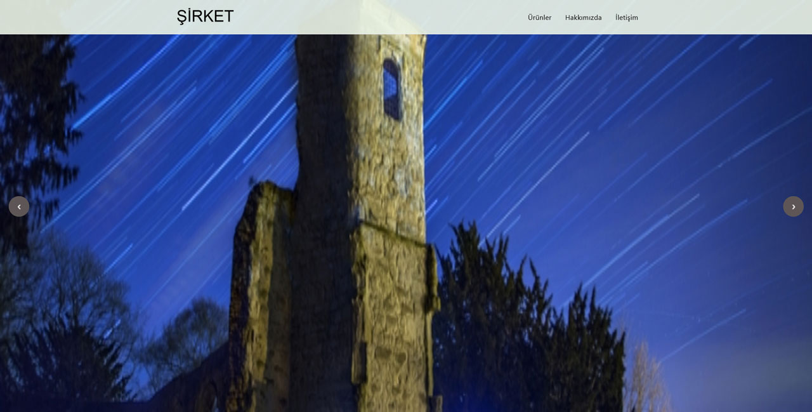

# Şirket siteleri için astro şablonu

[**Demo Site**](https://is-site-sablonu.netlify.app/)

## 🌼 Özellikler

    Tailwind CSS Komponentleri
    Hızlı site tasarım
    Temiz Kodlu 16 Komponent
    Özelleştirilebilinir
    Temalar oluşturulabilir
    Arama Motoru Optimizasyonu / Sitemap
    Open Graph / Facebook / Twitter
    Google Fonts ve Analytics
    İletişim Sayfasında otomatik adresli harita

[Örnek Komponent (BasicNavbar)](https://github.com/netlesh/astro-business-template/blob/main/src/components/navbars/BasicNavbar.astro#L1)

--------

**Dökümanlar**💭

[Astro](https://docs.astro.build/en/core-concepts/project-structure/)

[TailWind CSS](https://tailwindcss.com/docs/utility-first)

[DaisyUI](https://daisyui.com/docs/use/)

Örnek Ekran görüntüsü

--------

## Temel Ayarlar

### SEO

src\config\settings.js

src\components\BaseHead.astro

### Logo

src\components\Logo.astro

### Stil

<https://daisyui.com/theme-generator/>

### Menu

src\layouts\Layout.astro

### Ikonlar

<https://icon-sets.iconify.design/>

### Tailwind snippets

<https://daisyui.com/>

aşağıdaki sitelerden kod blokları kullanabilirsiniz

<https://www.tailwindsnippets.ml/snippets>

<https://tailblocks.cc/>

<https://tailwindcomponents.com/>

<https://stackdiary.com/tailwind-components-ui-kits/>

--------

## İletişim 📧

🕸 [cemkaan.com](www.cemkaan.com)

**StackOverFlow**:
 [@cem-kaan](https://stackoverflow.com/users/11993949/cem-kaan "Cem Kaan on stackoverflow")

**LinkedIn**:
  [@cemkaan](https://www.linkedin.com/in/cemkaan/ "Cem Kaan on LinkedIn")

**Twitter**: [Twitter](https://twitter.com/CemKaanGuru)

Web şablonu yapmak ve güncel tutmak için çok uğraştım ...

**Bağış için LiteCoin Adresim:** `LaF4Kjh7MYh7yYBjBX2CEPjGhZ614ffMh8`

**Bağış için Avax Adresim:**

`X-avax13txmctla8703kurvrqkv9fp73g7s7emgs3u5t7`
